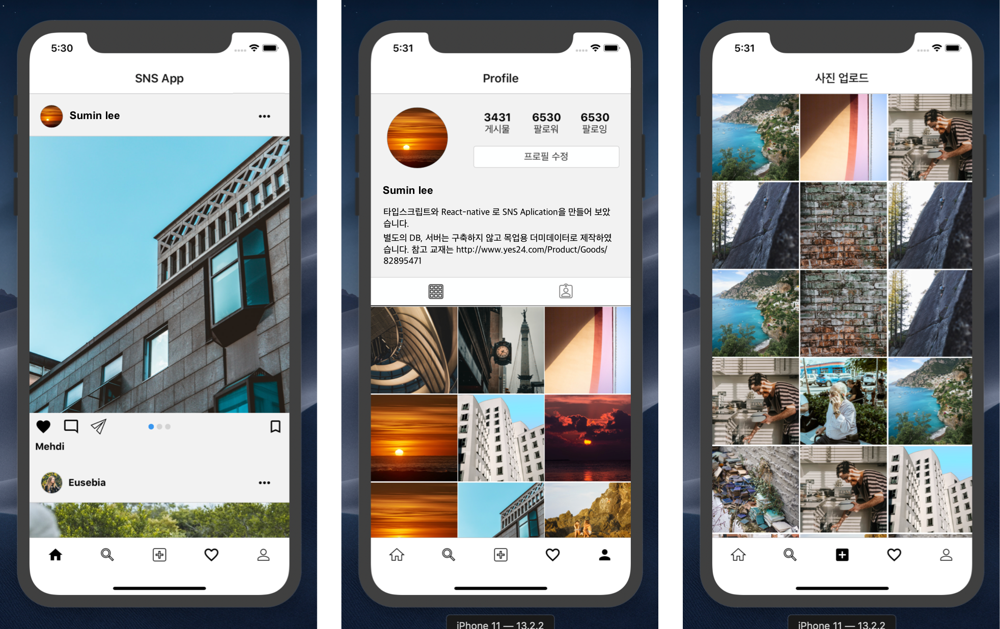

## Study_RN_SNS_application

### 리액트 네이티브와 타입스크립트로 SNS 어플리케이션 클론 코딩하기  ###
- React-Native
- Typescript
- Context Api, Styled-Component...
 

#### 실습 의의 ####

>ReactNative 와 Typescript 함께 도입하여 스터디 하였습니다.  
>다양한 종류의 Navigation 사용법을 익혔습니다. (Bottom tab, Drawer...)  
>대량의 이미지 데이터를 캐싱하는 방법을 스터디 하였습니다.   

참고 도서: http://www.yes24.com/Product/Goods/82895471